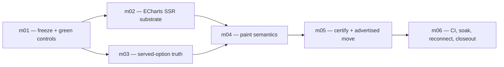

# DRAFT — Sprint 179 ECharts render-grading charter

**Status:** planning draft produced by s178-m05. Do not create or execute these missions until the
charter is grounded, critiqued, locked, and seeded into CMOS. The s178 spike proved feasibility but
did not supply true CI, close zrender's timing branch, or prove a memory plateau.

## Sprint thesis

Replace reconstruction-only contrast for operand-backed ECharts-primary charts with evidence from
the SVG ECharts actually renders, and fold independent normalized-SVG equality into determinism.
Keep option identity, cross-tool `contentHash` parity, spec-only bytes, ECharts coverage, and
`conformant:null` semantics intact. Ship the declared advertised movement and reconnect in the same
sprint.

The sprint is a **declared product and advertised-surface mover**. It is not a continuation of the
planning-only s178 spike. The governing findings are
`forge-s178-m05-echarts-render-grading-feasibility.md`.

## Decisions the locked plan must carry

1. **Runtime home:** ECharts becomes a direct runtime dependency of `@oods/viz-render`. Create its
   render worker lazily on the first renderable ECharts call, then keep it long-lived; the worker
   lazy-loads ECharts. zrender stays transitive. `@oods/viz-core` remains the zero-runtime option
   transformer; mcp-server keeps its existing dependency on viz-render.
2. **Rendered bytes:** render a clone of the first **projected MCP option**, not the pre-projection
   raw adapter object. `contentHash` already identifies projected/served bytes. A paint-affecting
   value lost during projection is a served-option defect to fix, never permission to grade an
   unserved closure.
3. **Static snapshot policy:** the render clone sets root `animation:false`. Force additionally sets
   `force.layoutAnimation:false` and runs with an explicitly versioned LCG seed derived from the
   canonical projected option, yielding a deterministic converged ECharts force snapshot without
   touching the served option. Circular initialization is only an optional optimization: a valid
   degenerate fixture proved that it can still create coincident nodes and consume random values.
4. **Own the RNG realm:** do not patch the MCP server realm's global `Math.random`. Run ECharts in a
   dedicated serialized render worker and patch only that worker realm during the synchronous
   force render, restoring in `finally`. There is no public ECharts seed hook; `layout:'none'` would
   replace force semantics. This worker choice remains a release-gated design until ESM/CJS,
   fault-restoration, adversarial-graph, and four-way isolation carriers are green.
5. **Normalization:** share only a first-appearance remap primitive. Vega and ECharts retain
   renderer-specific discovery contracts. The ECharts discoverer covers generated `zrN-cls-M`,
   `zrN-ani-M`, and `zrN-{s,g,p,c}M` tokens in attributes, URL references, selectors, keyframes,
   and animation declarations. It never rewrites `ecmeta_*`, geometry, author text, or broad ids.
6. **Paint semantics:** ECharts extraction returns separate `roleCPaints` and
   `roleAAssignment`. Role C includes actual visible carrier colors, including hierarchy tints;
   Role A uses semantic category cardinality and retains duplicates only for real palette recycling.
   Reuse grading math, not Vega's role-class scanner or assignment model wholesale.
7. **Geo policy:** register inline geometry from `__registration` before `setOption`, using one fixed
   internal map alias on the worker's render clone so ECharts' non-unregisterable global map store
   stays bounded. Rewrite clone-only geo/series references; never move the served option. Keep the
   ratified geo contrast exemption, including ordinal bubble, unless a separately approved decision
   changes it. Bubble without inline geometry gets no server render and no `renderHash`; the server
   does not fetch a map.
8. **Choropleth truth first:** emit join `featureProperty` as `geo.nameProperty` before grading
   choropleth. The series uses `geoIndex:0`; isolated measurement proved that geo-component field is
   load-bearing while `series.nameProperty` alone is not. This intentionally moves served option
   bytes and their content hashes/goldens. Renderer-only injection is forbidden.
9. **Response contract:** projected-option `contentHash` is unchanged in meaning. Optional
   `renderHash` is SHA-256 of normalized SVG and appears exactly when a render occurred. `stable`
   folds two independent option emissions and, when present, two independent renders. Coverage
   remains `uncertified`; conformant remains null. Cross-process equality is guaranteed only within
   the release's recorded certified matrix: resolved ECharts/zrender versions, supported
   Node/V8 and OS/architecture combinations, renderer/normalizer contract version, token version,
   dimensions, and snapshot policy. Expanding or changing an axis requires requalification; any
   dependency, token, contract, dimension, or policy change creates a reviewed render-hash epoch.
10. **Honest new failures:** the measured default sunburst descendant tint fails Role C. Pin the
    render-measured failure. Do not silently change colors in this sprint unless a separate visual
    remediation mover is approved and captured.

## Declared mover classes

The lock must enumerate exact files after grounding. At minimum, these classes are expected:

- `packages/viz-render`: runtime dependency/lockfile, lazy modular ECharts loader, emitter,
  renderer-specific normalizer, shared remap primitive, exports, tests, build outputs where tracked;
- `packages/viz-core`: joined-choropleth `geo.nameProperty` emission and exact adapter
  tests/goldens;
- `packages/mcp-server`: ECharts emit outcome, paint extraction, certify integration, D11 replacement,
  path-specific tests and fixtures;
- advertised surface: artifact.certify schema/tool description, generated TypeScript, API docs,
  spec-only clause controls, changelog/reconnect record;
- CI/release carriers: Linux determinism job, concurrency/soak/latency gates, and any capture index
  evidence required by the choropleth option mover.

No brand/token work, src/viz twin work, unrelated story cleanup, or accessibility-enforcement flip
belongs here. A discovered mover outside the locked list stops implementation for an amendment.

## Mission DAG

### s179-m01 — freeze the old contract and land green controls

**Objective:** establish a clean post-s178 baseline before product edits, enumerate exact movers,
and pin the old path without leaving a failing or skipped suite. This mission moves tests/fixtures
and the charter only; D11 source prose remains unchanged.

**Work:**

- Pin the post-s178 commit, ECharts/zrender versions, eight fixture operands, current projected
  option hashes, current ECharts spec-only outputs, the frozen categorical/geo caveats, and absence
  of ECharts `renderHash`.
- Capture two sequential fresh charts in one process to prove seven counter-only differences and
  substantive force nondeterminism. Separately capture fresh-process/cross-host normalized
  equality; zrender counters reset in a fresh process. Do not pre-normalize fixtures.
- Specify the exact future RED inputs and expected deltas for generated-token normalization,
  worker-seeded converged force (including degenerate coincident-node input), all three geo
  registration paths, bounded map aliases, joined-choropleth ramp paints, separate Role-C/Role-A
  hierarchy inputs, recycled `n=8` assignments, double render, renderHash presence, and lazy
  loading. Each implementation mission starts by materializing and running its own RED before code;
  m01 does not commit skipped or knowingly failing tests.
- Capture the current representative choropleth's missing `nameProperty`, default paint, and index
  -1 as baseline evidence. m03's first RED asserts the corrected ramp; its green must change the
  served option, not only the test.
- Add spec-only byte controls before any D11 movement. Keep the eight no-operand responses exact.
- Enumerate Storybook/static-index and advertised-surface capture obligations after the real file
  census. If the choropleth option reaches a critical story, capture it under the existing VRT
  controls.

**Success:** every baseline/control test is green with zero skips; every future RED has a concrete
input, expected failure, owner mission, and mutation bite; baseline provenance is committed before
implementation. A later test that passes before its behavior exists is invalid.

### s179-m02 — build the lazy, deterministic ECharts SSR substrate

**Depends on:** m01.

**Objective:** add an internal ECharts-to-normalized-SVG renderer in `@oods/viz-render` that renders
all eight projected option families without DOM/canvas/native packages and owns every global-state
boundary explicitly.

**Work:**

- Materialize and run the m01 substrate REDs first: counter normalization, rich ids, worker-seeded
  convergence, adversarial force inputs, geo registration/registry boundedness, lazy import, text
  timing/canvas independence, and dispose-on-fault. Capture the named failures before implementation
  and close the mission only after the same tests are green.
- Add aligned `echarts:^6.0.0` as a direct viz-render runtime dependency; leave zrender transitive
  and viz-core runtime dependencies untouched.
- Lazy-import public ECharts modular entrypoints and register Treemap, Sunburst, Sankey, Chord,
  Graph, Map, Scatter, and Lines plus SVG renderer and only the used
  title/legend/tooltip/aria/geo/visual-map components. viz-render externalizes node modules, so the
  aggregator modules are still evaluated; lazy first use—not tree-shaken bundle size—is the proven
  boundary. Instrument the worker itself: before the first renderable call there is no worker and no
  worker-side ECharts evaluation; afterward exactly one long-lived worker and one load exist.
  Main-realm module-cache absence is insufficient. Remeasure the built artifact.
- Export a narrow renderer function that accepts the projected option plus fixed dimensions and
  returns normalized SVG. Clone before removing `__registration` or applying snapshot policy; never
  mutate the option used for `contentHash`.
- Lazily create one dedicated long-lived ECharts render worker on the first renderable call and
  serialize its
  register/init/setOption/render/dispose jobs in v1 because map registries, painter/class counters,
  RNG, and text hooks are realm-global. The main MCP realm must never observe a patched hook. Use a
  worker pool only if the locked latency/concurrency budget disproves serialization and each worker
  independently satisfies the same controls.
- For inline geo, replace the render clone's caller map name with one fixed internal alias, rewrite
  its geo/series map references, and call `registerMap` immediately before `setOption`; re-register
  on every independent render. ECharts exposes no unregister and disposal does not clear its
  module-global map source store. Pin both first-use and warm behavior: a fresh worker without its
  first registration must fail with a typed no-map error, while a warmed worker must replace the
  alias on every job so a deliberately different FeatureCollection cannot reuse stale geometry. No
  registration carrier means “not renderable here,” not a network fetch.
- Apply root `animation:false`. On force, also apply `layoutAnimation:false`; derive a versioned LCG
  seed from canonical projected-option bytes, patch the worker realm's `Math.random` only across the
  synchronous render in `try/finally`, and pin converged geometry. Circular initialization cannot be
  the sole control: symmetric, duplicate-position, isolated-node, zero-value, and degenerate graphs
  must consume deterministically or be rejected by a typed input limit.
- Implement ECharts-specific structural token discovery plus the shared first-appearance remapper.
  Prove class/id/URL/CSS definition-reference integrity, idempotence, author-text preservation, and
  rich shadow/gradient/pattern/clip coverage.
- Close zrender's elapsed-time text-map branch. Remove/neutralize the clock decision (or force and
  assert width-map construction independent of elapsed time), or source-prove that governed options
  cannot reach it and hold that with stress. Worker isolation alone does not control `new Date()`.
  Before ECharts/zrender import in a fresh worker, install an ambient `document`/canvas/native
  measurement poison; exercise truncate/wrap with an uncached font while forcing width-map
  construction beyond the >16 ms/repeated >2 ms thresholds. A normal-load hash alone is
  insufficient.
- Dispose charts in `finally` on success and every typed failure. Invalid registration, unsupported
  option, unreadable SVG, and no-map conditions get distinct internal errors.

**Success:** all eight fixtures—the three geo fixtures carrying inline geometry—render twice
identically after normalization on Darwin and the real Linux CI worker; default force reds while
every admitted adversarial graph renders deterministically and every deliberately excluded case
passes its typed-rejection carrier; 1,000 unique caller geo ids do not grow the registry; no
DOM/canvas/native dependency; package ESM/CJS worker builds green; mcp startup plus a worker-side
spawn/load probe proves no worker or ECharts evaluation before first use and exactly one afterward.
If the text timing proof or worker isolation cannot close, block the sprint here.

### s179-m03 — make the served option render-truthful

**Depends on:** m01. May proceed in parallel with m02.

**Objective:** ensure the projected option being hashed and served contains all paint-affecting
information the renderer needs, starting with the known choropleth join defect.

**Work:**

- Materialize and run the joined-ramp and projected-vs-raw REDs before source edits; capture their
  named old-path failures, then finish with those exact tests green.
- Thread a joined choropleth's `join.featureProperty` to `geo.nameProperty`. Pin feature/series name
  matching, data indexes, value-ramp paints, diagnostics, and the exact intended
  option/hash/golden movement.
- Retain first and second projected option objects from `certify-echarts-emit` along with their
  canonical strings. Keep two independent adapter emissions; the second is the proof.
- Prove the projected object directly through the ECharts test harness; m03 does not depend on m02's
  production renderer. Update the stale comment that still describes bubble `symbolSize` as a
  dropped closure; the current adapter emits per-datum numeric sizes.
- Add a projected-vs-raw option discrimination test containing a paint-affecting projected value.
  Mutating only the raw object must not change the direct rendered proof; mutating served/projected
  paint must.
- Preserve `__registration` in the identity projection, strip only `__joinDiagnostics`, and remove
  `__registration` only from the render clone after extraction.
- Reprove `viz.render(...).contentHash === artifact.certify(...).contentHash` for all eight families;
  seven option hashes remain unchanged, joined choropleth changes exactly as declared.

**Success:** representative choropleth renders joined ramp colors and non-negative data indexes;
the direct ECharts proof starts from the exact projected object whose canonical bytes are hashed;
no tooltip-only closure influences paint or hash; cross-tool parity is green. Production-renderer
consumption remains m04 acceptance after both dependencies converge.

### s179-m04 — implement family-aware paint semantics

**Depends on:** m02 and m03.

**Objective:** extract actual ECharts chart paints without treating SVG path count as category
cardinality, and provide separate truthful inputs to Role C and Role A grading.

**Work:**

- Materialize and run the family extraction REDs before implementation: hierarchy tint Role C,
  semantic Role A, `n=8` recycling, node/edge index collision, stroke-channel marks, and geo
  exemption. Capture the named failures; no skipped tests survive mission close.
- Parse SVG structurally and select only `ecmeta_ssr_type="chart"`; exclude legend metadata,
  untagged text, and renderer chrome. Do not classify node vs edge by `data_index`, because ECharts
  does not serialize stored `dataType` and those indexes collide.
- Canonicalize rgb/hex/case; ignore `none`, `transparent`, invalid keywords, and unresolved URLs.
  Sankey link gradients stay auxiliary/excluded in v1; a future contract must define interpolation
  sampling and alpha compositing before grading them. Option-known borders/chrome are excluded
  explicitly.
- Return `roleCPaints` from visible carrier geometry and `roleAAssignment` from family semantics.
  Grade the two roles separately with the existing WCAG and CIEDE2000/CVD math, then combine their
  truthful worst verdict.
- Prove the m02 renderer derives its clone exclusively from m03's exact projected object; only the
  enumerated, separately pinned snapshot-policy transforms may differ. A raw-only paint mutation
  must not move the grade, while a projected paint mutation must.
- Cardinality sources are fixed: treemap/sunburst first-visible level; sankey/chord nodes; force
  sorted distinct non-empty groups. Never use total hierarchy nodes or SVG paths.
- Pin `n=8` as `[slot1..slot6,slot1,slot2]` for every categorical family so a real recycled pair
  reaches ΔE00=0. Pin repeated descendants/edges/ribbons within one category as no Role-A collision.
- Pin the current sunburst child tint as a Role-C fail while its Role-A semantic assignment remains
  valid. This is the discriminator proving the split is load-bearing.
- Keep choropleth, flow, and bubble under the geo exemption. Still extract/assert actual geo marks
  for renderer determinism. A separate governance amendment is required to grade ordinal bubble.
- Pattern/decal-only categorical paint and unreadable metadata become `ungradeable`, not
  `unchecked` or pass.

**Success:** one focused fixture + one mutation bite per family; hierarchy tint, wide-palette
recycling, node/edge index collision, stroke-channel force edges, filled force nodes, stroke-only
flow, and geo exemption all discriminate. The old reconstruction result is not used as fallback
after rendering was attempted.

### s179-m05 — wire render grading into artifact.certify and move the advertised contract once

**Depends on:** m04.

**Objective:** mirror the cartesian render-grade/double-render pattern on operand-backed ECharts
while preserving option identity and making every response/prose movement deliberate.

**Work:**

- Materialize and run the certify-path REDs before integration: projected option retention,
  independent second render, ECharts renderHash presence/absence, render perturbation, spec-only
  byte control, and path-scoped caveat replacement. Capture the named failures first.
- Make the ECharts operand evaluation path async. First independent emission supplies the projected
  option for paint grade + first normalized SVG hash; the second independent emission and render is
  retained as the proof.
- `contentHash` remains the canonical projected-option hash. `renderHash` is the first normalized
  SVG hash. `stable = optionStable && renderStable` whenever a render occurred. Response notes and
  advertised prose scope cross-process equality to the release's recorded certified matrix:
  resolved ECharts/zrender versions, supported Node/V8 and OS/architecture combinations,
  renderer/normalizer contract version, token version, dimensions, and snapshot policy.
- Emit `renderHash` exactly when a first render completed. If first render fails, omit it and report
  render failure honestly; if the second fails/differs, retain the first hash and set stable false.
- Five categorical ECharts traits become render-measured. Three geo traits remain contrast exempt;
  their inline-geometry calls still carry renderHash. Bubble without geometry remains option-only,
  carries an explicit no-server-map note, and has no renderHash.
- Preserve `coverage:'uncertified'`, `conformant:null`, warn-first a11y behavior, accuracy behavior,
  findings shape, and projected contentHash parity. No-operand/spec-only ECharts responses stay
  byte-exact and never render.
- Deliberately replace reconstruction-only ECharts caveats and the D11 byte pin in this mission,
  after the new path is green. Do not partially leak cartesian wording. Rebase exact response
  fixtures with declared string/field diffs.
- Edit tool-description/schema prose before one regeneration of generated TypeScript and API docs.
  The schema's optional `renderHash` structure already exists; update its path-specific presence
  semantics, not its optionality.

**Success:** all five categorical families are render-measured; all eight standard operand-backed
fixtures have a stable renderHash; spec-only controls are byte-identical; contentHash parity holds;
expected sunburst Role-C fail is visible; render perturbation makes stable false; extractor
perturbation moves the grade; every schema/output validates.

### s179-m06 — real CI, resource gates, reconnect, and closeout

**Depends on:** m05.

**Objective:** prove the machine, concurrency, and release claims the local feasibility spike could
not, then reconcile every declared mover and reconnect cached consumers.

**Work:**

- Run the eight-family normalized-hash matrix on the real Linux CI architecture. Include ASCII,
  CJK, combining marks, emoji, long/truncated labels, and rich shadow/gradient/pattern/clip options.
  Cross-host differences inside the recorded certified matrix—resolved ECharts/zrender versions,
  supported Node/V8 and OS/architecture combinations, renderer/normalizer contract version, token
  version, dimensions, and snapshot policy—block release; do not normalize substantive differences.
  Expanding or changing an axis requires requalification and a reviewed hash epoch.
- Run four concurrent artifact.certify calls (the current policy cap) with conflicting geo map
  names/data and mixed families. Prove worker isolation/serialization, deterministic hashes,
  correct map data, worker-local RNG restoration and the selected text-clock closure, no main-realm
  hook movement, and no deadlock.
- Run a 1,000-render post-warmup soak with 1,000 unique caller geo ids and FeatureCollections,
  worker-side forced-GC heap samples, process-wide RSS trend windows, and worker-side map-alias/
  registry instrumentation. Parent-thread GC and heap samples do not measure a worker isolate. If a
  pool is approved, collect each worker separately and aggregate. The locked plan must ratify an
  absolute ceiling plus a no-positive-trend/slope or repeated-length/doubling plateau test from an
  unmutated baseline; “recorded growth” and a two-window delta alone are not passing gates. Always
  assert disposal on fault paths.
- Pin worker startup + incremental ECharts first-use, warm small-chart, and force-size budgets.
  Feasibility references are 551 ms median incremental ECharts first-use after viz-render was
  resident, 3.0 ms warm treemap median, and measured circular-fixture force medians 34/198/960 ms at
  25/100/250 nodes; the lock chooses headroom and maximum supported size.
- Run viz-render, viz-core, mcp-server, focused artifact.certify, full root core, typecheck/build,
  schema generation parity, Storybook index/capture obligations, and clause controls sequentially.
- Perform physical Rule-9 bites after green: disable token normalization; restore random animated
  force or remove worker RNG isolation; in a fresh worker skip first registration, then in a warmed
  worker skip per-job re-registration before a conflicting FeatureCollection; restore caller-derived
  map aliases; remove choropleth geo.nameProperty; collapse Role C/A; cap assignment at distinct
  paints; replace a categorical carrier with an unresolved pattern and, separately, remove its
  chart metadata; remove the second render; eagerly spawn/import the worker; skip dispose; bypass
  the worker-local canvas/text-clock guard. Each named carrier must red, then be restored and rerun
  green.
- Reconcile porcelain/generated files against declared movers. Update the changelog with the exact
  artifact.certify movement and send the bridge reconnect message in the same sprint. Verify the
  rebuilt bridge/health and record that connect-time-cached schemas/descriptions were stale.

**Success:** every gate is green with zero skips; the D11 old wording is absent only where the new
render path supersedes it; spec-only bytes remain pinned; true CI and resource evidence is pasted;
reconnect is sent and verified; decision count is at least one per mission. Sprint-COMPLETE and the
commit boundary remain Derek's.

## Provisional release budgets to ratify at lock

These are deliberately provisional, not s178 facts:

- worker startup plus lazy ECharts first-use p95 ≤ 1,000 ms on the release runner;
- warm small-family render p95 ≤ 15 ms after load;
- converged force p95 ≤ 500 ms at 100 nodes and ≤ 1,500 ms at the supported 250-node ceiling;
- after 100 warmup + 1,000 measured renders, worker-side forced-GC heap delta ≤ 12 MiB as a separate
  absolute ceiling;
- worker-side post-GC heap must also satisfy a baseline-ratified no-positive-trend/slope or
  repeated-length/doubling plateau test. A two-window delta is insufficient because small linear
  retained growth can pass it while remaining unbounded;
- RSS must show a ratified plateau-window threshold from the unmutated CI baseline; the s178
  +172.9 MiB observation is a question, not an acceptable target. RSS remains process-wide; map
  alias/cardinality evidence remains worker-side.

If grounding cannot defend these numbers, the locked charter must replace them with measured
budgets before missions are created. It may not delete the gates.

## Explicit stop conditions

Block rather than ship if any of the following remains true:

- zrender's timing branch can move governed SVG under CI load;
- joined choropleth still paints defaults or needs renderer-only option repair;
- any family is stable only after normalizing geometry, paint, labels, metadata, or ordering;
- force is a timer-driven first frame, patches RNG in the shared MCP realm, leaks/restores a worker
  hook incorrectly, fails to render an admitted adversarial graph deterministically, fails a
  declared typed-rejection carrier, or exceeds the locked size budget;
- Role C and Role A share one lossy assignment list;
- a missing geo map silently produces an empty render or pass;
- caller-derived geo names cause the non-unregisterable ECharts map registry to grow without bound;
- projected served bytes cannot reproduce the intended paint and the implementation falls back to
  raw unserved bytes;
- the 1,000-render resource series does not plateau under the locked definition;
- spec-only ECharts bytes, coverage, conformant semantics, or unrelated surfaces move;
- advertised prose ships without regeneration, clause-control reconciliation, and reconnect.

## Rule-9 discrimination map

| Intent                     | Required bite                                                             |
| -------------------------- | ------------------------------------------------------------------------- |
| counter-only normalization | disable each cls/ani/s/g/p/c map in an emitting fixture; hash reds        |
| structural discovery scope | use blind global regex; author-text token-lookalike carrier reds          |
| force convergence          | remove seed; two controlled RNG streams on admitted degenerate input red  |
| force input boundary       | remove a declared typed limit; its rejection carrier reds                 |
| worker RNG isolation       | patch shared realm/leak restoration; concurrent hook carrier reds         |
| text/canvas independence   | intact worker guard stays equal under poison/slow map; bypass guard reds  |
| geo registration           | fresh worker skips first register; typed no-map carrier reds              |
| geo replacement truth      | warm alias skips re-register; conflicting geometry/hash carrier reds      |
| geo registry boundedness   | restore caller map names; unique-id soak shows registry/memory growth     |
| choropleth join truth      | remove `geo.nameProperty`; ramp/data-index carrier reds                   |
| actual Role C              | omit derived tint; sunburst expected-fail carrier reds                    |
| semantic Role A            | dedupe/cap `n=8`; recycled-pair carrier reds                              |
| paint readability          | unresolved pattern and separate missing metadata both go `ungradeable`    |
| projected-byte fidelity    | mutate raw-only paint carrier; grade stays; mutate projected; grade moves |
| independent render proof   | remove/alias second render; invocation/perturbation carrier reds          |
| lazy cost boundary         | eager-spawn worker/import ECharts; worker-side spawn/load carrier reds    |
| disposal/resource truth    | skip dispose; soak/fault-path carrier reds                                |
| D11 path scope             | leak new ECharts wording/field onto spec-only control; byte carrier reds  |

The final locked memo must carry this discrimination map into CMOS mission success criteria. A test
that cannot red under its named mutant does not satisfy Rule 9.
