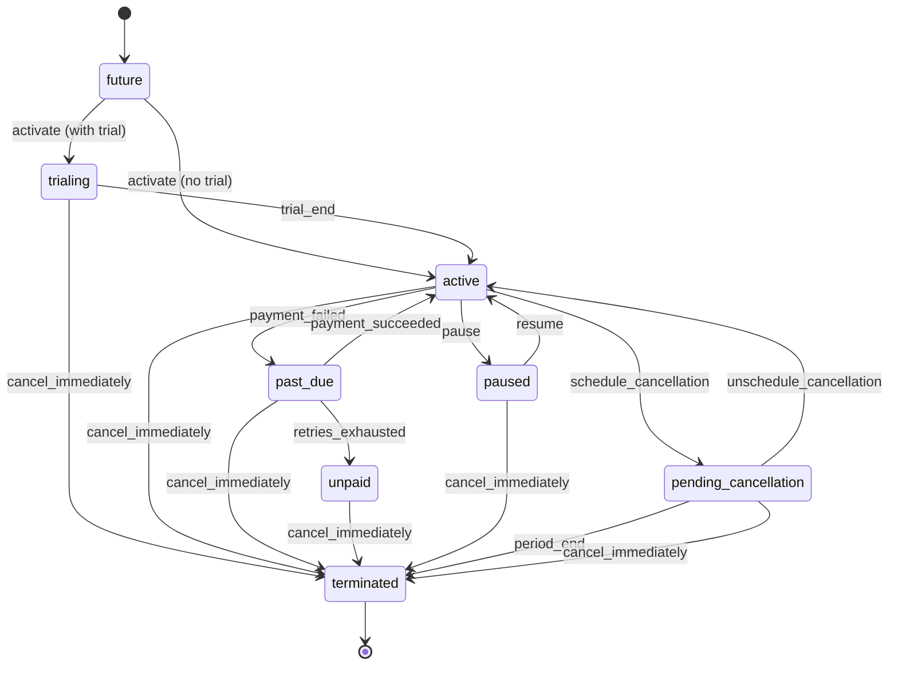
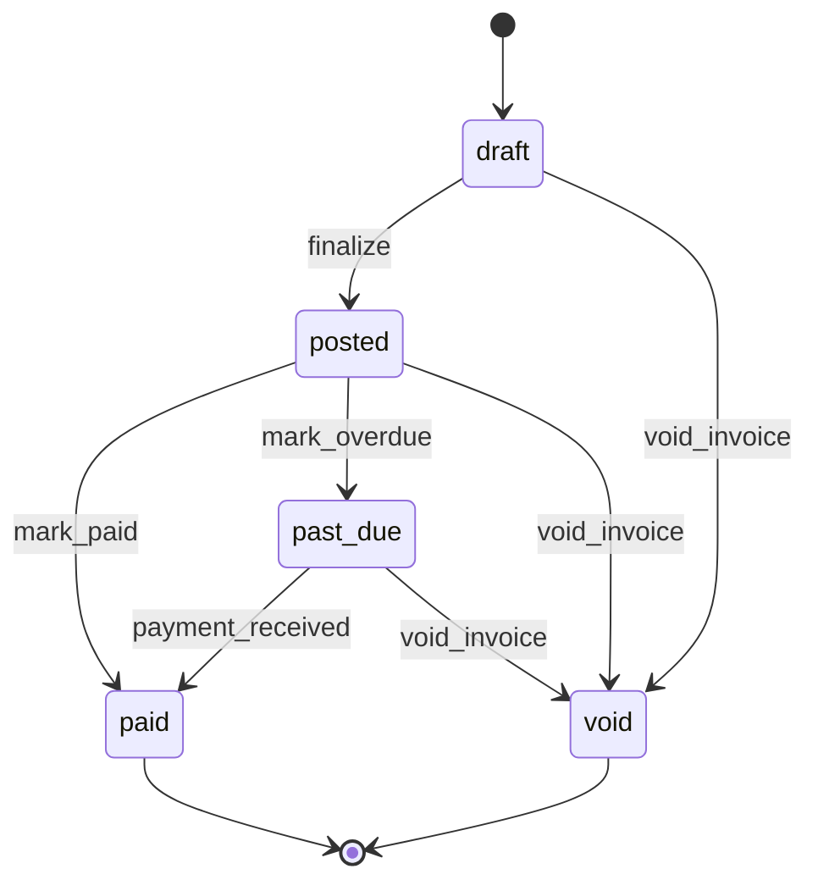

# Billing Lifecycle State Machines

**Version:** 2.0.0  
**Last Updated:** 2026-06-24

## Overview

This document describes the canonical state machines for Subscription (8-state) and Invoice (5-state) lifecycles. These state machines normalize provider-specific statuses into a consistent, event-driven model that prevents vendor terminology leakage and ensures UI consistency.

## Subscription State Machine (8-state model)

### States

The subscription model uses the **Stripe-literal split** of the former consolidated
`delinquent` state into `past_due` (retries ongoing → recoverable, keep access during
the grace window) and `unpaid` (retries exhausted → access revoked). The distinction is
load-bearing: the status-driven access-revocation rule cannot be expressed from a status
that collapses the two. `terminated` covers Stripe `canceled` + `incomplete_expired`.

| State | Description | Revenue Impact | Modifiable |
|-------|-------------|----------------|------------|
| `future` | Scheduled to start in the future | ❌ No | ✅ Yes |
| `trialing` | In trial period (free access) | ✅ Yes* | ✅ Yes |
| `active` | Active and current | ✅ Yes | ✅ Yes |
| `paused` | Temporarily suspended | ❌ No | ✅ Yes |
| `pending_cancellation` | Scheduled to end at period end | ❌ No | ✅ Yes |
| `past_due` | Payment failed, retries ongoing (recoverable; grace access) | ✅ Yes** | ✅ Yes |
| `unpaid` | Retries exhausted; access revoked | ❌ No*** | ✅ Yes |
| `terminated` | Permanently ended | ❌ No | ❌ No |

*Revenue-generating for tracking purposes, but typically no charges  
**Technically revenue-generating but with collection risk  
***Retries are exhausted and access is revoked — `unpaid` is dropped from `isRevenueGenerating` in s126-m02 (MRR/ARR semantic flip)

### State Transitions



### Transition Events

| Event | Description | From States | To State |
|-------|-------------|-------------|----------|
| `activate` | Start subscription | `future` | `trialing` or `active` (guard: trial period) |
| `trial_end` | End trial period | `trialing` | `active` |
| `pause` | Pause subscription | `active` | `paused` |
| `resume` | Resume subscription | `paused` | `active` |
| `schedule_cancellation` | Schedule cancellation at period end | `active` | `pending_cancellation` |
| `unschedule_cancellation` | Reverse a scheduled cancellation (Stripe: `cancel_at_period_end=false`) | `pending_cancellation` | `active` |
| `payment_failed` | Payment failed | `active` | `past_due` |
| `payment_succeeded` | Payment succeeded | `past_due` | `active` |
| `retries_exhausted` | Smart retries exhausted (no further attempts) | `past_due` | `unpaid` |
| `cancel_immediately` | Immediate cancellation | Any (except `terminated`) | `terminated` |
| `period_end` | Period end | `pending_cancellation` | `terminated` |

### Guards

**Activation Guard**: Determines whether `activate` transitions to `trialing` or `active`

```typescript
function activationGuard(subscription: CanonicalSubscription): 'trialing' | 'active' {
  return subscription.plan.trialPeriodDays > 0 ? 'trialing' : 'active';
}
```

## Invoice State Machine (5-state model)

### States

| State | Description | Collectible | Editable | Can Void |
|-------|-------------|-------------|----------|----------|
| `draft` | Uncommitted invoice | ❌ No | ✅ Yes | ✅ Yes |
| `posted` | Finalized and sent | ✅ Yes | ❌ No | ✅ Yes |
| `paid` | Fully paid | ❌ No | ❌ No | ❌ No |
| `past_due` | Overdue | ✅ Yes | ❌ No | ✅ Yes |
| `void` | Cancelled/voided | ❌ No | ❌ No | ❌ No |

> **SaaS-domain reconciliation (dunning-scoped).** The `SaaSBillingPayable` trait carries
> a 9-value `statusEnum` (`draft, posted, open, processing, past_due, paid, refunded,
> uncollectible, void`) — a superset of this canonical 5-state model. Only the
> dunning-relevant extras matter for access control: `open`/`processing` = pre-dunning
> (awaiting/settling payment); `past_due` = overdue with retries ongoing → subscription
> `past_due` (GRACE); **`uncollectible` = retries exhausted → mirrors subscription
> `unpaid` (REVOKE)**. The remaining superset values (`refunded`) are finance-reporting
> states outside the dunning/access path and are intentionally left unreconciled here.

### State Transitions



### Transition Events

| Event | Description | From States | To State |
|-------|-------------|-------------|----------|
| `finalize` | Finalize and send invoice | `draft` | `posted` |
| `mark_paid` | Mark as paid | `posted` | `paid` |
| `mark_overdue` | Mark as overdue | `posted` | `past_due` |
| `payment_received` | Record payment | `past_due` | `paid` |
| `void_invoice` | Void invoice | `draft`, `posted`, `past_due` | `void` |

## Past-Due Derivation

Some providers (e.g., Chargebee, Zuora) don't expose a `past_due` subscription status. We derive it from invoice history (the function retains the historical name `deriveDelinquency` for callers):

```typescript
function deriveDelinquency(
  subscription: CanonicalSubscription,
  invoices: CanonicalInvoice[]
): SubscriptionState {
  // Already past_due → preserve
  if (subscription.status === 'past_due') {
    return 'past_due';
  }

  // Only active subscriptions can become past_due
  if (subscription.status !== 'active') {
    return subscription.status;
  }

  // Check for unpaid past_due invoices
  const hasPastDueInvoices = invoices.some(
    (inv) => inv.status === 'past_due' && inv.balanceMinor > 0
  );

  return hasPastDueInvoices ? 'past_due' : 'active';
}
```

### Derivation Rules

1. **Preserve past_due**: If already `past_due`, keep it
2. **Non-active immune**: Only `active` can derive to `past_due`
3. **Require unpaid balance**: Ignore `past_due` invoices with zero balance
4. **Multi-invoice check**: Any past_due invoice triggers `past_due`

> Note: this derivation produces the recoverable `past_due` state. The transition to
> `unpaid` (retries exhausted → access revoked) is driven by the dunning retry window,
> not by invoice derivation — see the dunning section below.

## Status-Driven Access Control (Dunning)

Service access is decided from the subscription status, encoding Stripe's smart-retries
guidance — keep access while retries are ongoing, revoke once they are exhausted
(`hasServiceAccess` in `@/domain/billing/states`):

| Status | Access | Rationale |
|--------|--------|-----------|
| `active`, `trialing` | ✅ Keep | Normal access |
| `pending_cancellation` | ✅ Keep | Still within the paid period until `period_end` |
| `past_due` | ✅ Keep (**GRACE**) | Payment failed but smart retries are ongoing — recoverable |
| `unpaid` | ❌ **REVOKE** | Retries exhausted, no further attempts — Stripe's explicit guidance |
| `paused` | ❌ No access | Suspended |
| `future` | ❌ No access | Not yet started |
| `terminated` | ❌ No access | Ended |

The `past_due` (grace) vs `unpaid` (revoke) distinction is the load-bearing reason the
former consolidated `delinquent` state was split — a status that collapses the two cannot
express this rule. The retry window itself is carried on the invoice
(`SaaSBillingPayable.attempt_count` + `next_payment_attempt`). Source:
docs.stripe.com/billing/revenue-recovery/smart-retries.

## Provider Adapter Integration

All provider adapters MUST translate vendor-specific statuses to canonical states:

### Stripe Mapping

```typescript
const STRIPE_SUBSCRIPTION_MAP: Record<string, SubscriptionState> = {
  'incomplete': 'future',
  'incomplete_expired': 'terminated',
  'trialing': 'trialing',
  'active': 'active',
  'past_due': 'past_due', // retries ongoing → recoverable
  'canceled': 'terminated',
  'unpaid': 'unpaid', // retries exhausted → access revoked
  'paused': 'paused',
};

const STRIPE_INVOICE_MAP: Record<string, InvoiceState> = {
  'draft': 'draft',
  'open': 'posted',
  'paid': 'paid',
  'uncollectible': 'past_due',
  'void': 'void',
};
```

### Chargebee Mapping

```typescript
const CHARGEBEE_SUBSCRIPTION_MAP: Record<string, SubscriptionState> = {
  'future': 'future',
  'in_trial': 'trialing',
  'active': 'active',
  'non_renewing': 'pending_cancellation',
  'paused': 'paused',
  'cancelled': 'terminated',
  // No native past_due → derive from invoices
};

const CHARGEBEE_INVOICE_MAP: Record<string, InvoiceState> = {
  'pending': 'draft',
  'posted': 'posted',
  'payment_due': 'past_due',
  'paid': 'paid',
  'voided': 'void',
};
```

### Zuora Mapping

```typescript
const ZUORA_SUBSCRIPTION_MAP: Record<string, SubscriptionState> = {
  'Draft': 'future',
  'PendingActivation': 'future',
  'Active': 'active',
  'Suspended': 'paused',
  'Cancelled': 'terminated',
  'Expired': 'terminated',
  // No native trial/past_due → derive from context
};

const ZUORA_INVOICE_MAP: Record<string, InvoiceState> = {
  'Draft': 'draft',
  'Posted': 'posted',
  'Cancelled': 'void',
  // Zuora has no paid status → derive from balance
};
```

## Validation and Guards

### State Validation

All UI components MUST validate states before rendering:

```typescript
import { validateSubscriptionState, validateInvoiceState } from '@/utils/billing/state-guards';

// Reject unknown vendor strings
try {
  const state = validateSubscriptionState(rawStatus);
} catch (err) {
  // Log error, fallback to safe default, or reject payload
}
```

### CI Enforcement

The ESLint rule `no-provider-leakage` prevents direct use of provider types:

```typescript
// ❌ BAD: Provider types leak into UI
import type { Stripe } from 'stripe';
function StatusBadge({ status }: { status: Stripe.Subscription.Status }) { }

// ✅ GOOD: Canonical types only
import type { SubscriptionState } from '@/domain/billing/states';
function StatusBadge({ status }: { status: SubscriptionState }) { }
```

## Token Integration

Each state maps to semantic tokens for consistent UI rendering:

### Subscription State → Statusables Map

```json
{
  "subscription.status.future": {
    "intent": "info",
    "icon": "calendar",
    "label": "Future"
  },
  "subscription.status.trialing": {
    "intent": "success",
    "icon": "experiment",
    "label": "Trialing"
  },
  "subscription.status.active": {
    "intent": "success",
    "icon": "check_circle",
    "label": "Active"
  },
  "subscription.status.paused": {
    "intent": "warning",
    "icon": "pause",
    "label": "Paused"
  },
  "subscription.status.pending_cancellation": {
    "intent": "warning",
    "icon": "event_busy",
    "label": "Pending Cancellation"
  },
  "subscription.status.past_due": {
    "intent": "error",
    "icon": "error",
    "label": "Past Due"
  },
  "subscription.status.unpaid": {
    "intent": "error",
    "icon": "block",
    "label": "Unpaid"
  },
  "subscription.status.terminated": {
    "intent": "error",
    "icon": "cancel",
    "label": "Terminated"
  }
}
```

### Invoice State → Statusables Map

```json
{
  "invoice.status.draft": {
    "intent": "info",
    "icon": "draft",
    "label": "Draft"
  },
  "invoice.status.posted": {
    "intent": "info",
    "icon": "send",
    "label": "Posted"
  },
  "invoice.status.paid": {
    "intent": "success",
    "icon": "check_circle",
    "label": "Paid"
  },
  "invoice.status.past_due": {
    "intent": "error",
    "icon": "error",
    "label": "Past Due"
  },
  "invoice.status.void": {
    "intent": "warning",
    "icon": "cancel",
    "label": "Void"
  }
}
```

## Storybook Documentation

Visual lifecycle documentation is available in Storybook:

- **Subscription Lifecycle**: `Domains/Billing/Subscription Lifecycle`
- **Invoice Lifecycle**: `Domains/Billing/Invoice Lifecycle`

Each story demonstrates:
- Current state badge with severity mapping
- Available actions for the state
- Valid transitions from the state
- State machine flow diagram

## Testing

Comprehensive test coverage (50 tests) validates:

- ✅ All valid state transitions
- ✅ Invalid transition rejection
- ✅ Guard logic (trial period)
- ✅ Delinquency derivation
- ✅ State validation
- ✅ Helper functions (revenue, terminal, collectible)
- ✅ Time-based calculations (aging, days until change)

Run tests:

```bash
pnpm test tests/domain/billing/states.spec.ts
```

## API Reference

### State Machines

```typescript
import {
  SubscriptionStateMachine,
  InvoiceStateMachine,
  type SubscriptionState,
  type InvoiceState,
  type SubscriptionEvent,
  type InvoiceEvent,
} from '@/domain/billing/states';

// Check if transition is valid
SubscriptionStateMachine.canTransition('active', 'pause'); // true

// Execute transition
const nextState = SubscriptionStateMachine.transition('active', 'pause'); // 'paused'

// Get valid events from current state
const events = SubscriptionStateMachine.getValidTransitions('active');
// ['pause', 'schedule_cancellation', 'payment_failed', 'cancel_immediately']
```

### State Guards

```typescript
import {
  deriveDelinquency,
  validateSubscriptionState,
  getStateLabel,
  getStateSeverity,
  getAvailableSubscriptionActions,
  daysUntilStateChange,
  calculateInvoiceAging,
} from '@/utils/billing/state-guards';

// Derive delinquency from invoices
const correctedState = deriveDelinquency(subscription, invoices);

// Validate state
const state = validateSubscriptionState(rawStatus); // throws if invalid

// Get UI metadata
const label = getStateLabel('active'); // "Active"
const severity = getStateSeverity('past_due'); // "error"
const actions = getAvailableSubscriptionActions('active');
```

## Migration from Legacy States

### Old → New Mapping

| Legacy Status | New State | Notes |
|---------------|-----------|-------|
| `delinquent` | `past_due` or `unpaid` | v1 consolidated `delinquent` is split: `past_due` (retries ongoing) vs `unpaid` (retries exhausted) |
| `canceled` | `terminated` | More accurate terminology |
| `cancelled` | `terminated` | UK spelling normalized |
| `incomplete` | `future` | Stripe-specific |
| `incomplete_expired` | `terminated` | Stripe-specific |
| `non_renewing` | `pending_cancellation` | Chargebee-specific |

### Migration Script Placeholder

```typescript
// Future: Historical data migration
// See: scripts/migrations/normalize-billing-states.ts
```

## FAQ

**Q: Why "past_due" and "unpaid" instead of a single "delinquent"?**  
A: v1 used a single `delinquent` subscription state. The Stripe-literal model splits it into `past_due` (payment failed but smart retries are ongoing — recoverable to `active`, access kept during the grace window) and `unpaid` (retries exhausted, no further attempts — access revoked). The status-driven access-revocation rule cannot be expressed from a status that collapses the two, so the distinction is load-bearing. `past_due` doubles as an invoice state, but the subscription and invoice state machines are distinct types (`SubscriptionState` vs `InvoiceState`), so there is no collision. Source: docs.stripe.com/api/subscriptions/object.

**Q: Can I skip state validation?**  
A: No. ESLint enforces validation. Unvalidated vendor strings will leak into UI and break token mappings.

**Q: What happens if a provider adds a new status?**  
A: The adapter will throw an error. Add a mapping to the adapter's translation table.

**Q: How do I handle "incomplete" subscriptions?**  
A: Map to `future` and use payment intent status separately.

**Q: Can terminated subscriptions be reactivated?**  
A: No. `terminated` (Stripe `canceled` + `incomplete_expired`) is a terminal state — the state machine has **no outbound transition** from it, and Stripe is explicit that "you can't reactivate a canceled subscription." Create a new subscription instead.

**Q: Is a scheduled cancellation reversible?**  
A: Yes — but only before it takes effect. `pending_cancellation` (Stripe `cancel_at_period_end=true`) is **reversible** until `period_end`: the `unschedule_cancellation` event (Stripe: set `cancel_at_period_end=false`) returns the subscription to `active`. This is the load-bearing distinction from `terminated`: a *scheduled* cancellation can be undone; an *effected* cancellation cannot. Source: docs.stripe.com/billing/subscriptions/cancel.

## References

- [Industry Research: State Machine Maturity](../../cmos/Industry-Research/R1.2_A%20Cross-Platform%20Analysis%20of%20Core%20Data%20Models-%20Archetypes,%20Convergence,%20and%20Divergence%20in%20User,%20Account,%20and%20Subscription%20Schemas.md)
- [Direction Check: Sprint 17 Mandate](../../cmos/docs/OODS%20Direction-Check-for-sprint-17.md)
- [Research: Canonical Billing Model](../../cmos/missions/research/R13.5_Canonical-Model-Subscription-and-Invoice.md)
- [Billing ACL Documentation](./billing-acl.md)

## Version History

| Version | Date | Changes |
|---------|------|---------|
| 2.0.0 | 2026-06-24 | Stripe-literal extend-8 subscription model: split `delinquent` into `past_due` (retries ongoing) + `unpaid` (retries exhausted). Source: docs.stripe.com/api/subscriptions/object |
| 1.0.0 | 2025-10-25 | Initial release: 7-state subscription, 5-state invoice, delinquency derivation |

